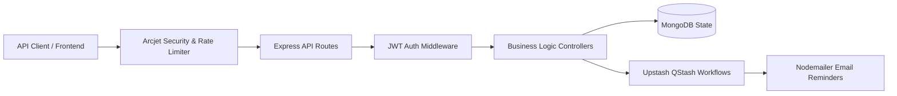

# Subscription Management & Automation API

[](https://nodejs.org/)
[](https://www.mongodb.com/)
[](https://arcjet.com/)
[](https://upstash.com/)
[](LICENSE)

A modular RESTful backend API engineered with **Node.js (ES Modules)**, **Express**, and **MongoDB/Mongoose** for managing user subscriptions, automated renewal tracking, and scheduled reminder workflows. Built with API security and rate limiting via **Arcjet** and background reminder scheduling via **Upstash QStash Workflows**.

---

## 🏗️ Architecture & Features



### Key Engineering Features

- **Authentication & Authorization**: Secure signup, login, and token verification utilizing JSON Web Tokens (`jsonwebtoken`) and `bcryptjs` password hashing.
- **Subscription Lifecycle Management**: Full CRUD operations for subscription records with status tracking (`active`, `cancelled`, `expired`), renewal frequencies (daily, weekly, monthly, yearly), and automatic renewal calculation.
- **Automated Reminder Workflows**: Integrated with `@upstash/workflow` and QStash to schedule and trigger reminder jobs prior to subscription expiration.
- **API Defense & Bot Detection**: Enforces security shields and rate limiting using `@arcjet/node` middleware.
- **Transactional Email Dispatch**: Pre-configured email notification templates sent via `nodemailer`.

---

## 📡 API Endpoints

### Authentication (`/api/v1/auth`)
| Method | Endpoint | Description |
|---|---|---|
| `POST` | `/api/v1/auth/sign-up` | Register a new user account |
| `POST` | `/api/v1/auth/sign-in` | Authenticate user and receive JWT cookie/token |
| `POST` | `/api/v1/auth/sign-out` | Clear authentication session |

### Subscriptions (`/api/v1/subscriptions`)
| Method | Endpoint | Description |
|---|---|---|
| `GET` | `/api/v1/subscriptions` | Retrieve all subscriptions (filtered by user) |
| `GET` | `/api/v1/subscriptions/:id` | Get subscription details by ID |
| `POST` | `/api/v1/subscriptions` | Create a new subscription record |
| `PUT` | `/api/v1/subscriptions/:id` | Update subscription details |
| `DELETE` | `/api/v1/subscriptions/:id` | Remove or cancel subscription |
| `GET` | `/api/v1/subscriptions/upcoming-renewals` | Fetch subscriptions approaching renewal |

### Workflows (`/api/v1/workflows`)
| Method | Endpoint | Description |
|---|---|---|
| `POST` | `/api/v1/workflows/subscription/reminder` | Webhook triggered by Upstash QStash to dispatch reminders |

---

## 📁 Project Structure

```text
subscription-tracker/
├── config/             # Arcjet, Upstash, and environment configuration
├── controllers/        # Request handling and business logic
├── database/           # MongoDB Mongoose connection handler
├── middlewares/        # JWT auth, error handler, and Arcjet security guards
├── models/             # Mongoose schemas (User, Subscription)
├── routes/             # Express API route modules
├── utils/              # Email dispatcher and helper utilities
├── app.js              # Application entry point
├── example.env         # Environment configuration template
└── package.json
```

---

## 🚀 Getting Started

### Prerequisites

- [Node.js](https://nodejs.org/) (v18+)
- [MongoDB](https://www.mongodb.com/) (Local or Atlas URI)
- [Upstash Account](https://upstash.com/) (QStash for workflows)
- [Arcjet Account](https://arcjet.com/) (for rate limiting and bot detection)

### Installation

1. **Clone the repository:**
   ```bash
   git clone https://github.com/Bedru-Mekiyu/subscription-tracker.git
   cd subscription-tracker
   ```

2. **Install dependencies:**
   ```bash
   npm install
   ```

3. **Configure environment:**
   ```bash
   cp example.env .env
   ```
   Populate your `.env` variables:
   ```env
   PORT=5500
   NODE_ENV=development
   DB_URI=mongodb://localhost:27017/subscription-tracker
   JWT_SECRET=your_jwt_secret_key
   JWT_EXPIRES_IN=1d
   ARCJET_KEY=your_arcjet_key
   ARCJET_ENV=development
   QSTASH_URL=http://localhost:8080
   QSTASH_TOKEN=your_qstash_token
   EMAIL_PASSWORD=your_email_app_password
   ```

4. **Start the development server:**
   ```bash
   npm run dev
   ```

---

## 📜 License & Author

Maintained by **[Bedru Mekiyu](https://github.com/Bedru-Mekiyu)**.  
Licensed under the [MIT License](LICENSE).
